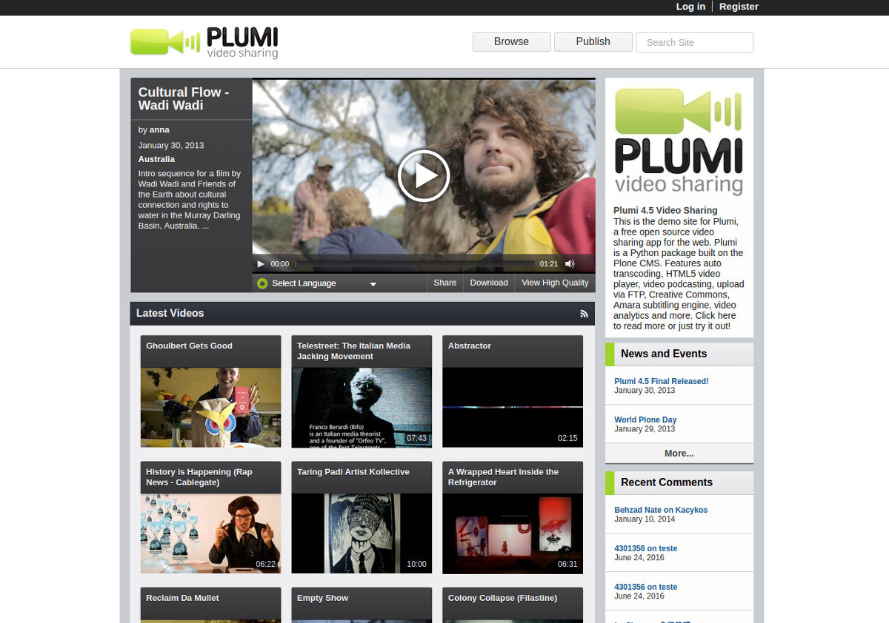

December 2017 update
====================

We are moving tickets from the Plumi tracker (trac.plumi.org) here, for historical reasons.

Plumi video sharing system
==========================

Plumi is a Free Software video-sharing web application based on Plone and produced by **https://www.engagemedia.org** in collaboration with **https://unweb.me**.

Plumi enables you to create your own sophisticated video-sharing site. It includes a beautiful adaptive skin using Diazo, server-side transcoding of most video formats, upload progress bar, thumbnail extraction, HTML5 video playback and embedding, subtitles using Amara, large file uploading via FTP, social media integration, threaded commenting and user feedback forms, customised user profiles and a range of other useful features.

Plumi demo screenshot:

More info
=========

- Check out **http://plumi.org**
- For the Plumi Manual visit **http://en.flossmanuals.net/Plumi/Introduction**
- For a demo Plumi site visit **http://demo.plumi.org**
- For the most up to date Plumi resource, checkout **https://trinket.io/mgogoulos/courses/plumi-4-5#/**

Installation
============

=====
Specs
=====
As of December 2016 Plumi has been tested on the following Operating Systems: **Debian Jessie**, **Ubuntu 16**, **CentOS 7**. It can be installed on other systems as well as long as they contain python2.7 and the system dependencies are installed.

For a small/medium portal hosting videos you'd need at least 1 core, 1G RAM, and disk size depending to the size of original videos being uploaded, plus the ones being transcoded (so if you estimate that you'll have 50 videos uploaded, each one of 100MB, you would need at least 70G of disk space)

For bigger installations you would need more RAM and cores. The specs for criticalcommons.org and engagemedia.org, the two biggest plumi installations are:

- **criticalcommons.org**: containing thousands of videos. 8 cores, 16G RAM and 2T of disk space.
- engagemedia.org: almost 10k videos. 2T disk for videos, 8 cores, 13G RAM. The disk OS and plumi is on a SSD disk, while a normal scsi disk is mounted for the transcoded/original videos.

If plumi is installed in /home/plumi.app, then

- /home/plumi.app/transcoded is used for transcoded videos
- /home/plumi.app/var/blobstorage for storing the original video files

So after installation you can delete /home/plumi.app/transcoded and /home/plumi.app/var/blobstorage and make them links to a separate disk (so you can maintain it easier). Of course if you can spare the whole system to be on SSD disks, you don't have to keep the above dirs on a separate disk

============
Installation
============

**********************************
Step 1:Install system dependencies
**********************************

Debian Jessie
-------------

::

    root@debian:~# apt-get update; apt-get upgrade -y;
    root@debian:~# apt-get install -y build-essential pkg-config git-core python-dev libssl-dev zlib1g-dev libxslt1-dev libjpeg62-turbo-dev groff-base python-virtualenv vim libpcre3 libpcre3-dev
    root@debian:~# apt-get update; apt-get upgrade -y

Ubuntu 16.04
------------

::

    root@ubuntu:~# apt-get update; apt-get upgrade -y
    root@ubuntu:~# apt-get install -y build-essential pkg-config git-core python-dev libssl-dev zlib1g-dev libxslt1-dev libjpeg62-dev groff-base python-virtualenv vim libpcre3 libpcre3-dev
    root@ubuntu:~# apt-get update; apt-get upgrade -y

CentOS 7
--------

::

    root@centos:~# yum groupinstall "Development Tools" -y
    root@centos:~# yum install openssl-devel sqlite-devel bzip2-devel libxslt-devel pcre groff ruby-devel libxml2 libxml2-devel libxslt libxslt-devel git-all zlib zlib-devel zlibrary zlib-devel libjpeg-turbo libjpeg-turbo-devel groff groff-perl bzip2-devel openssl-devel ncurses-devel sqlite-devel readline-devel tk-devel python-virtualenv tkinter freetype freetype-devel python-lcms lcms-devel python-webpy python-devel x264-devel libvpx-devel python-imaging wget ftp nano vim xz-libs -y

*****************
Step 2: Get plumi
*****************

We will get plumi from it's github repository and install through a virtualenv environment. We'll install plumi in /home/plumi.app

::

    root@user:~# cd /home/
    root@user:/home# git clone https://github.com/plumi/plumi.app/
    root@user:/home# cd plumi.app
    root@user:/home/plumi.app# virtualenv --no-setuptools .

Add users zope and www-data to the system (if server has nginx or apache www-data will be there already)::

    root@user:/home# adduser zope
    root@user:/home# adduser www-data

*********************
step 3: Edit settings
*********************

Edit file site.cfg and change users, if necessary (ftp user, cache user, etc). We'll leave the default site.cfg settings, that allow us to start supervisord (a supervisor process that is responsible to start/stop/monitor all processes plumi needs in order to run) as root, and then chmod to simple system users. Plumi processes can run as different users, for security reasons, while the default settings require that a user zope exists in order to run uwsgi web server.

However, we need to change these two lines::

    www-server-name = new.plumi.org
    www-videoserver-name = newvideos.plumi.org

into::

    www-server-name = mgogoulos.plumi.org
    www-videoserver-name = videos-mgogoulos.plumi.org

to reflect our existing dns. We need 2 dns names for plumi and the transcode daemon although they exist on the same system.

If this is a testing installation and we don't have dns yet, we can let the default settings (new.plumi.org and newvideos.plumi.org) and set these dns on our local /etc/hosts::

    www.xx.yyy.zzz new.plumi.org newvideos.plumi.org

where www.xx.yyy.zzz is your ip address. After the buildout finishes we'll open our browser on http://new.plumi.org and will see the plumi installation

**Make sure you set the same dns entries on /etc/hosts on both plumi server and your local system, if you're going to use dns names that are not resolvable, otherwise plumi won't behave correctly**

*************************
Step 4: Run the buildout
*************************

root@user:/home/plumi.app# ./bin/python bootstrap.py && ./bin/buildout -v

This takes some time, it downloads and installs (on our virtualenv) all necessary packages for plumi to run, then installs the software and creates a plumi portal (on top of Plone).

*********************
Step 5 Install ffmpeg
*********************

There are 3 ways we can use ffmpeg to transcode videos:

1. Install ffmpeg via source. Make sure it gets installed with libvpx/libvorbis
2. Install ffmpeg via system package. We will cover this case for the 3 operating systems mentioned
3. Install ffmpeg through the plumi buildout. This is tuned to compile ffmpeg with required settings and install ffmpeg on plumi installation dir. However the buildout hasn't been tested on all the 3 operating systems. On Debian Jessie buildout completes well and ffmpeg can trancode webm profiles, but segfaults when compiling mp4 files (so this cannot be used on Debian Jessie)

We will cover the system package installation here:

Debian Jessie
-------------
ffmpeg can be found on Debian Backports. To enable edit /etc/apt/sources.list and append line::

    deb http://ftp.debian.org/debian jessie-backports main

Now install ffmpeg::

    apt-get update; apt-get install ffmpeg -y

Ubuntu 16.04
------------

ffmpeg is part of the packages of a default Ubuntu 16.04 distribution so use apt-get install to install

::

    root@ubuntu:~# apt-get update; apt-get install ffmpeg -y

CentOS 7
--------

ffmpeg can be found on atrpms repo. Enable epel-release before we can install ffmpeg::

    root@centos:~# yum -y install epel-release
    root@centos:~# rpm -Uvh http://dl.fedoraproject.org/pub/epel/7/x86_64/e/epel-release-7-8.noarch.rpm
    root@centos:~# rpm -ivh https://www.mirrorservice.org/sites/dl.atrpms.net/el7-x86_64/atrpms/stable/atrpms-repo-7-7.el7.x86_64.rpm

Now edit /etc/yum.repos.d/atrpms.repo and under [atrpms] change the baseurl and enabled from. Set::

    baseurl=http://dl.atrpms.net/el$releasever-$basearch/atrpms/stable
    enabled=1

to::

    baseurl=https://www.mirrorservice.org/sites/dl.atrpms.net/el$releasever-$basearch/atrpms/stable
    enabled=0

now you can install ffmpeg::

    root@centos:~# yum -y install ffmpeg

*************************
Step 6: start supervisord
*************************

With plumi buildout having finished and ffmpeg installed on our system, it's time to run supervisord::

    root@user:/home/plumi.app# ./bin/supervisord

after a few seconds, check that everything is up and running::

    root@user:/home/plumi.app# ./bin/supervisorctl status
    cache                            RUNNING    pid 22650, uptime 0:21:29
    nginx                            RUNNING    pid 22651, uptime 0:21:29
    ploneftp                         RUNNING    pid 22649, uptime 0:21:29
    transcodedaemon                  RUNNING    pid 22612  uptime 0:21:29
    uwsgi                            RUNNING    pid 22646, uptime 0:21:29
    worker                           RUNNING    pid 22647, uptime 0:21:29
    zeo                              RUNNING    pid 22645, uptime 0:21:29

(in case something is not running, check logs on var/log and partrs/transcodedaemon)

We have noticed that the worker process does not start properly some times.
If that's the case, edit file parts/worker/etc/zope.conf and on the zodb_db main
section make sure the blob-dir is set as the full path on the filesystem (eg /home/plumi.app/var/blobstorage).

We are good! Let's open a browser to http://new.plumi.org and see Plumi

Screenshot of an installed Plumi site:

.. image:: docs/plumi-vanilla.jpg

=============
Other sources
=============

- Deprecated installation instructions can also be found on docs/INSTALL.rst
- For migration instructions see docs/MIGRATE.txt

Help and support
================

- Questions and comments to discuss@lists.plumi.org
